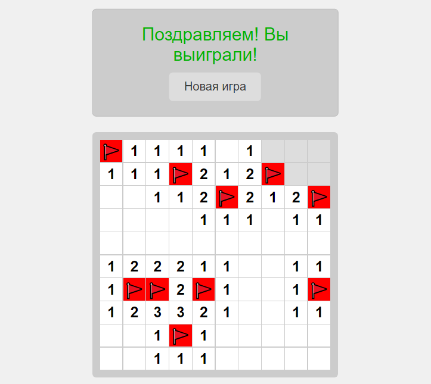

# Minesweeper

Классическая игра "Сапёр", реализованная на чистом JavaScript без использования фреймворков.



## Описание

Веб-версия классической игры "Сапёр". Игроку предстоит очистить игровое поле от мин, используя числовые подсказки. Каждая клетка с числом показывает, сколько мин скрыто в соседних клетках.

### Особенности
- Игровое поле 10x10 клеток
- 10 случайно расположенных мин
- Система флажков для отметки предполагаемых мин
- Автоматическое открытие пустых областей
- Подсчёт правильно установленных флажков
- Сообщение о победе с возможностью начать новую игру

## Как играть

1. **Левый клик** мыши по клетке - открыть клетку
2. **Правый клик** мыши по клетке - установить/снять флажок
3. Цифра в открытой клетке показывает количество мин в соседних клетках
4. Чтобы победить, нужно правильно отметить флажками все мины

## Установка и запуск

1. Склонируйте репозиторий:
```bash
git clone https://github.com/instocky/minesweeper.git
```

2. Откройте `index.html` в любом современном браузере

## Технологии
- HTML5
- CSS3 (Grid Layout)
- JavaScript (ES6+)

## Структура проекта
```
minesweeper/
│
├── index.html         # Основной HTML файл
├── README.md         # Документация проекта
└── screenshot.png    # Скриншот игры
```

## Функциональность

### HTML
- Адаптивная верстка
- Семантическая структура
- Поддержка мобильных устройств

### CSS
- Grid Layout для игрового поля
- Анимации для сообщений
- Стилизация клеток и флажков

### JavaScript
- Генерация случайного расположения мин
- Система подсчёта соседних мин
- Рекурсивное открытие пустых областей
- Проверка победных условий
- Обработка кликов мыши

## Планы по развитию
1. Добавить таблицу рекордов
2. Реализовать разные уровни сложности
3. Добавить счётчик времени
4. Реализовать сохранение прогресса

## Вклад в проект

Если у вас есть предложения по улучшению игры, пожалуйста:
1. Создайте форк проекта
2. Создайте ветку для вашей функции (`git checkout -b feature/название`)
3. Зафиксируйте изменения (`git commit -am 'Добавлена новая функция'`)
4. Отправьте ветку (`git push origin feature/название`)
5. Создайте Pull Request

## Лицензия

MIT License. Подробности в файле [LICENSE](LICENSE)

## Автор

Ваше Имя - [GitHub](https://github.com/ваш-юзернейм)